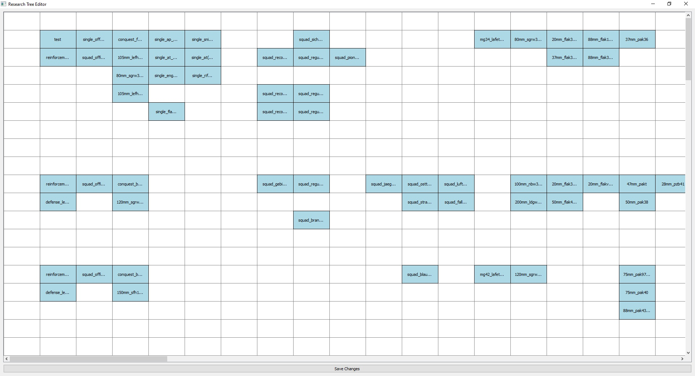

### Visual GoH dc research tree editor

Inside the mod folder is the current version of the mod, you can just modify it for a american, fin etc tree. If you have a question ask me ^^

## Usage
1. **Select the Correct Research File**: 
   Open the `sc.py` script and modify the line to select the correct research file for the nation you want to edit. For example:

   ```python
   editor = TreeEditor("unit_research_ger.set")  # <--------- modify line 140
   ```

   - German: `unit_research_ger.set`
   - Finland: `unit_research_fin.set`
   - Russia: `unit_research_rus.set`
   - USA: `unit_research_usa.set`

2. **Run the Script**:
   Execute the script to open the visual editor:

   ```bash
   python sc.py
   ```

3. **Edit the Research Tree**:
   Use the graphical interface to drag and drop research items to new positions.

4. **Save Your Changes**:
   Click the "Save Changes" button to update the research file with your new layout.

5. **Export to Mod Folder**:
   Copy the modified research file to your mod's `\resource\set\dynamic_campaign` folder.

