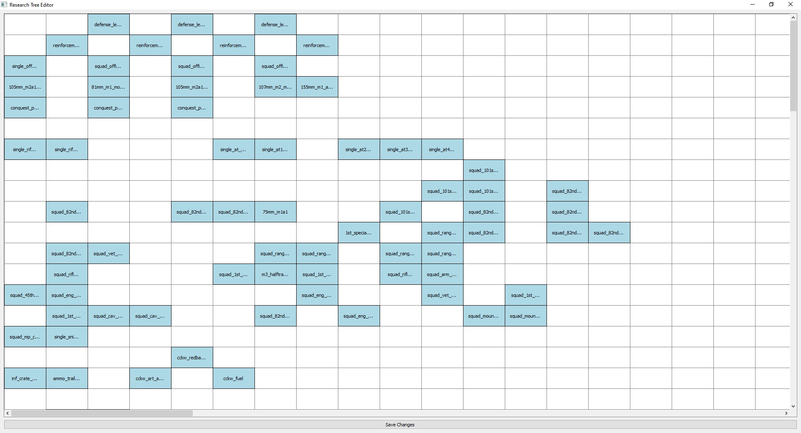
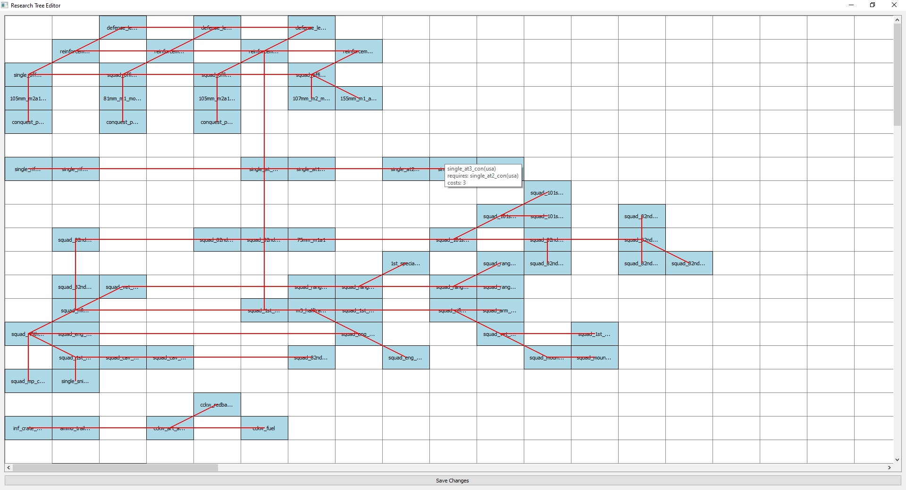
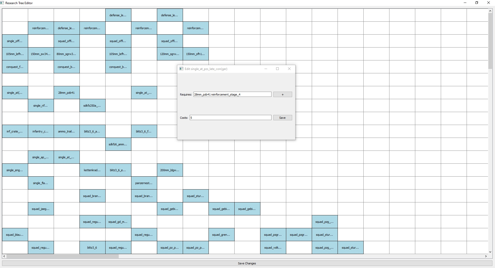

### Visual GoH dc research tree editor
<details>
  <summary>Screenshots</summary>

    
    
    

</details>

Inside the mod folder is the current version of the mod, you can also use this as a template for your mod. 

## Usage

(0. [download](https://github.com/Ppaja/gohtreetool/archive/refs/heads/main.zip) this repo)
1. **Select the Correct Research File**: 
   Open the `sc.py` script and modify the line to select the correct research file for the nation you want to edit. For example:

   ```python
   editor = TreeEditor("unit_research_ger.set")  # <--------- modify line 268
   ```

   - German: `unit_research_ger.set`
   - Finland: `unit_research_fin.set`
   - Russia: `unit_research_rus.set`
   - USA: `unit_research_usa.set`


2. **Run the Script**:
   Execute the script to open the visual editor:

   ```bash
   python sc.py
   ```

   Or run one of the .bat files.

3. **Edit the Research Tree**:  
   Use the graphical interface to modify the research tree:  

   - Drag and drop research items to new positions.  
   - Double-click on a research item to edit the cost and the "requires" field:  
     - **Cost**: Simply change the number and save.  
     - **Requires**: Type in the unit name (copy/paste from the game file) and save, or click the `+` button and select the unit you want to add as a requirement. You can add multiple requirements 
   - Hold **"V"** to display the current connections.  


4. **Save Your Changes**:
   Click the "Save Changes" button to update the research file with your new layout.

5. **Export to Mod Folder**:
   Copy the modified research file to the mod's `\resource\set\dynamic_campaign` folder.
   The mod folder can now be uploaded to workshop with your design of the research tree 

